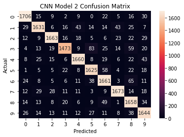
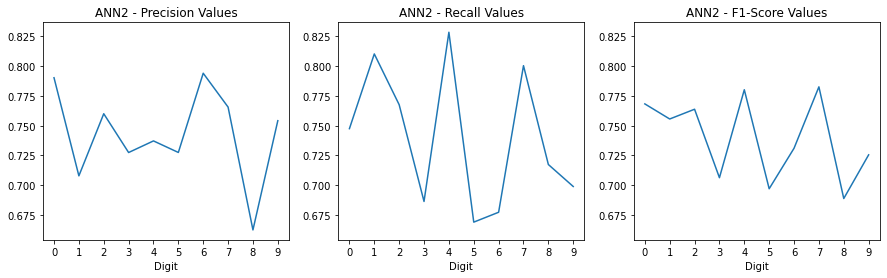

# House Number Image Recognition
Employing Neural Networks to Recognize Digits

## Background and Problem Statement
The Street View Housing Numbers (SVHN) dataset contains over 600,000 images of house numbers captured from Google Street View Images.  Each image is 32 x 32 pixels and is identified as the correct digit.  The data provided for this project were gray-scale images dervied from the SVHN dataset, pared back to only 60,000 images in total (presumaly to make this much less computationally intensive).  The goal of this project was to create a model which could identify the images from this dataset as their correct digit.  To do this, both artificial and convolutional neural networks (ANN and CNN) algorithms were employed.

## Initial Processing and Exploratory Data Analysis

*Note:  Due to the computationally intensive nature of this model and the large amount of data, this project was completed in Google Colab so that the built-in GPU could be utilized to decrease processing time. It should also be noted that the ANN and CNN models were run in separate notebooks.  Given that the steps taken for each model were very similar, this project overview will describe the models as if they were all completed in a single notebook, and describe the differences where appropriate.*

***DAN - GO BACK AND DOWNLOAD A NEW VERSION OF THE CODE AS A JUPYTER NOTEBOOK AND DON'T DO THE HTML THING

The provided dataset was pre-split into training and test datasets of 42,000 and 18,000 images respectively.  These were each assigned to their own dataframes.  Examining the images revealed hat each image was stored as a 32 x 32 matrix with values between 0 and 255 (indicating color/darkness).  For the ANN model, the 32 x 32 matrices representing each image were reshaped to a singe array of 1024 elements.  This was not done for the data being processed by the CNN model, and presumably, this is to maintain the 2-dimensional proeprties of the image so that the convolution fileters could be applied.  The data being used in both models were then normalized by dividing all elements by 255 so that all numerical values would range proprotionally between 0 and 1 for neural network algorithms.  The image label datasets (ranging between between 0 and 9) were then one-hot encoded so that each digit could be mapped to a category into which the nerual networks could assign the provided image data.

## Models Run

All Artificial and Convolutional Neural Network models were run with Keras as sequential models.  For both ANN and CNN models, two variations were run to showcase the benefits of adding features to improve model accuracy.  By nature, the ANN models were far simpler than the CNN models, and this is reflected specifically in the both quantities and types of layers that make up each model.  Below are brief descriptions of each along with tables of the detailed properties of each model.  The bolded values in tables below highlight the differences between the properties of the two model variations for the ANN and CNN models.  Each model was fit against the provided training dataset which was further split into a validation (test) dataset comprised of 20% of the original training data and a yet smaller training dataset for fitting the model.  This allowed for a comparison of the model's accuracy aginst the both the validation data and the smaller training dataset with each training epoch.

### Artificial Neural Network (ANN) Model Properties
ANN Model 1 implmented two hidden layers employing ReLU activation funcitons.  Model 2 added more hidden layers, dropout layers, and batch normalization layers, and increased the number of nodes speified in each hidden layer.  The models are compared side-by-side in the table below for easy comparison (click the dropdown arrow to reveal).

  
  

    <b><i>TABLE - Artificial Neural Network Properties (Click for Dropdown)</i></b>
    

  
   
  
| | Layer | **Model 1 Properties** || | Layer | **Model 2 Properties** |
| --- | --- | ---|---| --- | --- | ---|
|1| Hidden | Nodes: 64, Activation: ReLU ||1| Hidden | ***Nodes: 256***, Activation: ReLU |
|2| Hidden | Nodes: 32, Activation: ReLU ||2| Hidden | ***Nodes: 128***, Activation: ReLU |
|||||***3***| ***Dropout*** | ***Dropout Rate: 0.2*** |
|||||***4***| ***Hidden*** | ***Nodes: 64, Activation: ReLU*** |
|||||***5***| ***Hidden*** | ***Nodes: 64, Activation: ReLU*** |
|||||***6***| ***Hidden*** | ***Nodes: 32, Activation: ReLU*** |
|||||***7***| ***Batch Normalization*** | ***None Specified*** |
|3| Output | Nodes: 10, Activiation: Softmax ||8| Output | Nodes: 10, Activiation: Softmax |
|  |  |  || |  |  |
|-| Compile | Loss: Categorical Crossentropy Optimizer: Adam, Learning Rate: 0.001 Metrics: Accuracy ||- | Compile | Loss: Categorical Crossentropy Optimizer: Adam, ***Learning Rate: 0.0005*** Metrics: Accuracy |
|-| Fitting | Validation Split: 0.2 Batch Size: 128 Epochs: 20 ||- | Fitting | Validation Split: 0.2 Batch Size: 128 ***Epochs: 30*** |
  

### Convolutional Neural Network (CNN) Model Properties
CNN model 1 employed convolutional filters with 3x3 kernels and LeakyReLU activation layers in addition to max-pooling, flattening, and dense layers.  Model 2 added more convolutional filter layers, along with dropout, and batch normalization layers.  The models are compared side-by-side in the table below for easy comparison (click the dropdown arrow to reveal).

  
  

    <b><i>TABLE - Convolutional Neural Network Properties (Click for Dropdown)</i></b>
    

  
   

| | Layer | **Model 1 Properties** || | Layer | **Model 2 Properties** |
| --- | --- | ---|---| --- | --- | ---|
|1| Convolutional | Filters: 16, Kernel Size: 3x3, Padding: Same ||1| Convolutional | Filters: 16, Kernel Size: 3x3, Padding: Same |
|2| LeakyReLU | Slope: 0.1 ||2| LeakyReLU | Slope: 0.1 |
|3| Convolutional | Filters: 32, Kernel Size: 3x3, Padding: Same ||3| Convolutional | Filters: 32, Kernel Size: 3x3, Padding: Same |
|4| LeakyReLU | Slope: 0.1 ||4| LeakyReLU | Slope: 0.1 |
|5| Max Pooling | Pool Size:  2x2 ||5| Max Pooling | Pool Size:  2x2 | 
|||||***6***| ***Batch Normalization*** | ***None Specified*** |
|||||***7***| ***Convolutional*** | ***Filters: 32, Kernel Size: 3x3, Padding: Same*** |
|||||***8***| ***LeakyReLU*** | ***Slope: 0.1*** |
|||||***9***| ***Convolutional*** | ***Filters: 64, Kernel Size: 3x3, Padding: Same*** |
|||||***10***| ***LeakyReLU*** | ***Slope: 0.1*** |
|||||***11***| ***Max Pooling*** | ***Pool Size:  2x2*** |
|||||***12***| ***Batch Normalization*** | ***None Specified*** |
|6| Flatten | None Specified ||13| Flatten | None Specified |
|7| Dense | Nodes: 32 ||14| Dense | Nodes: 32 |
|8| LeakyReLU | Slope: 0.1 ||15| LeakyReLU | Slope: 0.1 |
|||||***16***|***Dropout*** | ***Dropout Rate: 0.5***|
|9| Output | Nodes: 10, Activiation: Softmax ||17| Output | Nodes: 10, Activiation: Softmax |
|  |  |  || |  |  |
|-| Compile | Loss: Categorical Crossentropy Optimizer: Adam, Learning Rate: 0.001 Metrics: Accuracy ||- | Compile | Loss: Categorical Crossentropy Optimizer: Adam, Learning Rate: 0.001 Metrics: Accuracy |
|-| Fitting | Validation Split: 0.2 Batch Size: 32 Epochs: 20 ||- | Fitting | Validation Split: 0.2 ***Batch Size: 128*** ***Epochs: 30*** |

## Model Evluations and Performance Comparisons
The improvements in accuracy of each model aginst validation and training datasets after each training epoch are shown in the plots in the dropdown below.  It can be seen that after approximately 10 epochs, the models tend to stabalize, and their final accuracy values are summarized in the table below.

| Model | Layer Properties | Training Accuracy | Validation Accuracy |
| --- | --- | :-: | :-: |
| ANN 1 | 2 Hidden Layers| 63.5% | 62.8% |
| ANN 2 | 5 hidden Layers, 1 Dropout, 1 Batch Normelization | 73.7% | 73.6% |
| CNN 1 | 2 Filter Layers, 3 LeakyReLU, 1 Max Pooling, 1 Flatten, 1 Dense | 97.7% | 87.0% |
| CNN 2 | 4 Filter Layers, 5 LeakyReLU, 2 Max Pooling,  2 Batch Normelization, 1 Flatten, 1 Dense, 1 Dropout | 95.0% | 90.7% |

From the above comparison, the CNN Model 2 performs the best on the validation data.  Furhter, with a training accuracy closer to the validation accuracy, CNN Model 2 is less overfit than CNN Model 1.

  
  

    <b><i>Model Accuracies Plotted Against Training Epochs (Click for Dropdown)</i></b>
    

  
   

    
    
  

### Performance Against Test Data
For both the ANN and CNN models, the second model variations had better accuracy than the first variations.  These models were selected to then predict the images in the original test dataset (not the derived validation datasets from before).  The confusion matrices are provided below showing of all correctly identified images, in addition to the counts of all possible combinations of errors.

***Confusion Matrices:***

  

Save for obtaining a general sense of which digits are being confused with each other, the fact that there are a different number of images corresponding to each digit

***Precision, Recall, and F1-Score Values for Each Model***

The confusion matrices above show the number of images for each digit that were correctly identified (the values on the diagonal) along with the counts of all possible classification errors.  The classification reports provide additional information for each digit. Namely, the recall values corresponding to each number can be interpreted as the accuracy with which each number was classified by each model.  For the ANN model, these recall values range from 66.9% to 82.8%, while the CNN model recall values acheive a tighter range of 86.0% to 94.3%.  When examining specific numbers, it can be seen that the number 1 is more easily classified by each model, and the number 3 is not as easily classified, hvaing some of the lowest recall values for each model.  While one can speculate why this is the case with qualitative comparisons of how similar the shapes of these numbers are to others, a more in-depth understanding of how the neural networks are processing these images would be required to discuss these observations more intelligently.

In a model final model comparison, the model accuracies against the test data are taken from the classification reports above and are appended to the prior model performance table.

| Model | Layer Properties | Training Accuracy | Validation Accuracy | Test Accuracy |
| --- | --- | :-: | :-: | :-: |
| ANN 2 | 5 hidden Layers, 1 Dropout, 1 Batch Normelization | 73.7% | 73.6% | ***74.1%*** |
| CNN 2 | 4 Filter Layers, 5 LeakyReLU, 2 Max Pooling,  2 Batch Normelization, 1 Flatten, 1 Dense, 1 Dropout | 95.0% | 90.7% | ***90.9%*** |

It can be seen that both models performed similarly to their predicted accuracies, and that CNN model 2 is the better model when evaluating accuracy.

## Conclusions
The general conclusions are summaraized as follows:
- While more complex and computationally intensive, the convolutional neural network models performed far better than the artificial neural network models when comparing both the overall model accuracy, and the recall values for individual numbers
- The most accurate model was the CNN2 model, achieving an accuracy of 90.9%
- For both the ANN and CNN models, adding dropout and batch normalization layers, and increasing the quantities of hidden or convolutional filter layers (with higher numbers of nodes or filters respectively) increased the model accuracy

## Note Regarding MIT ADSP Weekly Projects:
**The code for this project was provided by the program, and the students were required to fill in the key lines of code and answer the provided prompts**

# Conact Info
- Email: <a href = "mailto: drossetti12@gmail.com" style="color: red">drossetti12@gmail.com</a>
- LinkedIn: [https://www.linkedin.com/in/daniel-r-10882139/](https://www.linkedin.com/in/daniel-r-10882139/)
- MIT ADSP Certificate:  [https://www.credential.net/0655323a-4a50-49d6-9dfc-a81e5e4b7ca8#gs.o5fack](https://www.credential.net/0655323a-4a50-49d6-9dfc-a81e5e4b7ca8#gs.o5fack)
- MIT ADSP ePortfolio: [https://eportfolio.greatlearning.in/daniel-rossetti](https://eportfolio.greatlearning.in/daniel-rossetti)
